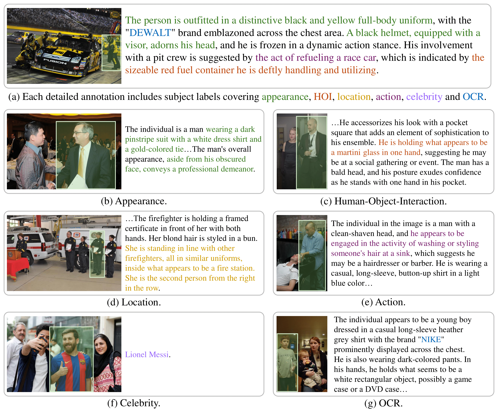

# HC-RefLoCo

This repository contains the data loader, evaluation, and inference demonstrations for several LMMs on the [HC-RefLoCo dataset.](https://huggingface.co/datasets/Jinjing713/HC-RefLoCo).


## Dataset Download

The [HC-RefLoCo dataset](https://huggingface.co/datasets/Jinjing713/HC-RefLoCo) can be downloaded from Hugging Face:
```bash
sudo apt install git-lfs
git clone https://huggingface.co/datasets/Jinjing713/HC-RefLoCo
```
- Hint: Since the GitHub and Huggingface repositories share the same name, it is recommended to establish a new dir-path for the code or dataset.

## Installation

You can install the data loader and evaluation API with the following command:

```bash
pip install 'git+https://github.com/ZhaoJingjing713/HC-RefLoCo.git'
# (add --user if you don't have permission)

# Or, to install it from a local clone:
git clone https://github.com/ZhaoJingjing713/HC-RefLoCo.git
pip install -e HC-RefLoCo
```

## Data Loader

We provide the `HCRefLoCoDataset` class, which inherits from `torch.utils.data.Dataset`:

```txt
- dataset_path (str): Path to the dataset directory.
- split (str): Dataset split, typically "val", "test" or "all".
- custom_transforms: Custom image transformations to apply.
- load_img (bool): Whether to load images from the tar file when init the class.
- images_file (str): Name of the images 'tar.gz' file.
```

Additionally, we offer the:
1. `change_split` method, which accepts a `split` parameter and is used to switch the dataset split.
2. `load_images_from_tar` method, which accepts `img_path`, an optional parameter of the images `tar.gz` file. 

## Evaluation

### Evaluation API Introduction

We provide the `HCRefLoCoEvaluator` class, which takes the following arguments:

```txt
- dataset (HCRefLoCoDataset|str): The dataset/path_to_dataset to evaluate.
- split (str): The split of the dataset to evaluate. Default is 'val'.
- thresholds (List[float]): The thresholds to evaluate the IoU. Default is [0.5, 0.55, 0.6, 0.65, 0.7, 0.75, 0.8, 0.85, 0.9, 0.95].
- show_ths (List[float]): The thresholds to display in the evaluation results. Default is [0.5, 0.75, 0.9].
- subjects (List[str]): The subjects to evaluate. Default is ['Appearance','Human-Object Interaction','Celebrity','OCR','Action','Location'].
- small_size_th (int): The threshold to define a small size bounding box. Default is 128.
- large_size_th (int): The threshold to define a large size bounding box. Default is 256.
```

To evaluate predictions, the `evaluate` method is called, which accepts two arguments: `predictions` and `save_file`. The `predictions` should be a list of dictionaries, each containing three keys: `[id, pred_bbox, format]`. The `id` is the annotation ID, and the `format` specifies the format of `pred_bbox`, which should be either `xyxy` or `xywh`.

The `change_split` method is also provided in `HCRefLoCoEvaluator`.

### Evaluation Output

The evaluation considers three parts:

1. The accuracy under various IoU thresholds and the average accuracy of IoU from 0.5 to 0.95 with a stride of 0.05.
2. The accuracy of each subject. There are six subjects: 'Appearance', 'Human-Object Interaction', 'Celebrity', 'OCR', 'Action', 'Location.'
3. The accuracy of small, medium, and large objects.

Here is an example output for the predictions from Shikra on the validation set:

```txt
Item                             | Value
--------------------------------------------------------------------------
iou|0.5                          | 0.5709580838323354
iou|0.75                         | 0.35419161676646704
iou|0.9                          | 0.10546407185628742
iou|0.5:0.95                     | 0.34418413173652695
Accs for copy                    | 0.571, 0.354, 0.105, 0.344
--------------------------------------------------------------------------
Subject-Appearance               | 0.32812803961446635
Subject-Human-Object Interaction | 0.3241014044275172
Subject-Celebrity                | 0.5630392156862745
Subject-OCR                      | 0.31104693140794226
Subject-Action                   | 0.3015205271160669
Subject-Location                 | 0.31951608941292065
Subject evaluation for copy      | 0.328, 0.324, 0.563, 0.311, 0.302, 0.32
--------------------------------------------------------------------------
Small                            | 0.14040650406504065
Medium                           | 0.3437775330396476
Large                            | 0.3820263394193355
Size evaluation for copy         | 0.14, 0.344, 0.382
```
- *The results may differ slightly from those in the paper due to the introduction of randomness.*


To reproduce this result, you can run:

```bash
cd ./demo_models/shikra/
python eval_pred.py \
    --pred_dir exp-hc_refloco/shikra_eval_hc_refloco \
    --split val \
    --dataset_path <HC-RefLoCo Path>
```

## Demo Models

Before performing inference on the HC-RefLoCo dataset, you need to install the models according to their instructions and download their weights. The instructions are located in each model's folder.

### 1. Shikra

1. Modify the `dataset path` and `split` in the 4th and 5th rows of `demo_models/shikra/config/_base_/dataset/DEFAULT_TEST_HC-RefLoCo.py`.
2. Modify the `output path` in the 4th row of `demo_models/shikra/config/shikra_eval_hc_refloco.py`.
3. Run the inference command:
```bash
cd ./demo_models/shikra
accelerate launch --num_processes 4 \
        --main_process_port 20917 \
        mllm/pipeline/finetune.py \
        ./config/shikra_eval_hc_refloco.py \  
        --cfg-options model_args.model_name_or_path=<Checkpoint Path>
```
4. Run `eval_pred.py` to evaluate the inference results.
```bash
python eval_pred.py \
    --pred_dir <Output Path Set in Step 2> \
    --split <val or test> \
    --dataset_path <HC-RefLoCo Path>
```
The `val` split inference results are provided at `demo_models/shikra/exp-hc_refloco/shikra_eval_hc_refloco`, you can run the `step 4` to reproduce results.

### 2. Ferret

1. Run the inference command:
```bash
cd demo_models/ml-ferret
python ./ferret/eval/model_hc_refloco.py \
    --model-path <checkpoint path> \
    --data-path <HC-RefLoCo Path> \
    --data-split <val or test> \
    --answers-file <Output Path> \
    --resume
```

2. Run `eval_pred.py` to evaluate the inference results.

```bash
python ferret/eval/eval_refexp_hc_refloco.py \
    --prediction_file <Output Path> \
    --data_path <HC-RefLoCo Path> \
    --data_split <val or test>
```

The `val` split inference results are provided at `demo_models/ml-ferret/output_hc_refloco`, you can run the `step 2` to reproduce results.

### 3. KOSMOS-2

1. Run the inference and evaluation command:
```bash
cd demo_models/kosmos-2
python huggingface_kosmos.py \
    --dataset-path <HC-RefLoCo Path> \
    --split <val or test> \
    --output-path <jsonl output path> \
    --resume
```

The `val` split inference results are provided at `demo_models/kosmos-2/output/predictions.jsonl`, you can run the `step 1` to reproduce results.

### Coming Soon...

Further model instructions and updates will be provided soon.

## Dataset License
The HC-RefLoCo dataset is released under the [Creative Commons Attribution-NonCommercial 4.0 International (CC BY-NC 4.0) license](https://creativecommons.org/licenses/by-nc/4.0/).
Please note that the images in the HC-RefLoCo dataset are derived from the following datasets, each with their respective licenses:
- **COCO 2017**: Licensed under the [Creative Commons Attribution 4.0 International (CC BY 4.0) license](https://creativecommons.org/licenses/by/4.0/).
- **Objects365**: Licensed under the [Creative Commons Attribution 4.0 International (CC BY 4.0) license](http://creativecommons.org/licenses/by/4.0/).
- **OpenImages V7**: Licensed under the [Creative Commons Attribution 4.0 International (CC BY 4.0) license](https://creativecommons.org/licenses/by/4.0/) and [Creative Commons Attribution 2.0 International (CC BY 2.0) license](https://creativecommons.org/licenses/by/2.0/).
- **Laion 5B**: Licensed under the [Creative Commons Attribution 4.0 International (CC BY 4.0) license](https://creativecommons.org/licenses/by/4.0/).

By using the HC-RefLoCo dataset, you agree to comply with the licensing terms of these source datasets.